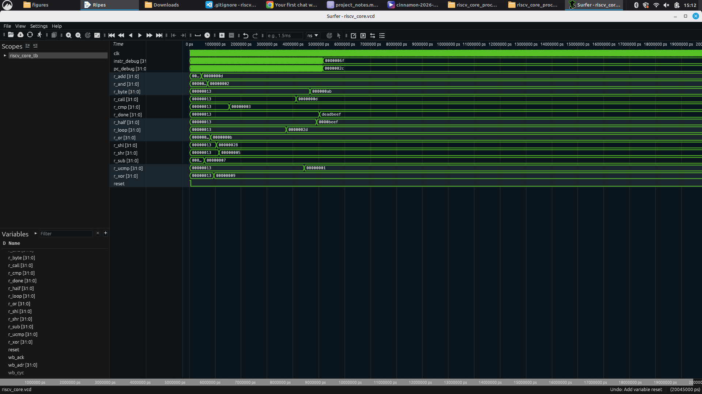

# Single-Cycle RISC-V (RV32I) Processor

A single-cycle RISC-V processor (RV32I) built from scratch in Verilog, with a Wishbone bus interface — designed, verified in simulation, and made GCC-compatible so it can run real compiled C code.

---

## Overview

This project implements a RISC-V CPU core module by module (ALU, register file, control unit, immediate generator, load/store unit, etc.), verifies each instruction class in simulation, and integrates a full GCC toolchain flow (linker script + startup code + hex conversion) so C programs can be compiled and run directly on the core.

## Features

- Single-cycle RV32I datapath (fetch, decode, execute, memory, writeback in one clock cycle)
- Wishbone bus master interface for memory and peripheral access
- Byte / halfword / word memory access with correct sign/zero extension
- Full branch and jump support: `BEQ`, `BNE`, `BLT`, `BGE`, `BLTU`, `BGEU`, `JAL`, `JALR`
- GCC-compatible: runs bare-metal, freestanding C programs compiled with the standard RISC-V GCC toolchain
- Verified in simulation with Icarus Verilog, with waveform inspection via GTKWave / Surfer

## Architecture

| Module | Purpose |
|---|---|
| `Adder.v` | General-purpose adder |
| `PCplus4.v` | Computes PC + 4 |
| `program_counter.v` | Holds current instruction address |
| `Mux1.v` / `Mux2.v` / `Mux3.v` | Datapath source selection |
| `Control_Unit.v` | Instruction decode → control signals |
| `ALU_Control.v` | Determines ALU operation |
| `ALU_unit.v` | Arithmetic / logic operations |
| `immediate_generator.v` | Sign-extends immediates |
| `Register_File.v` | 32 general-purpose registers (x0–x31) |
| `riscv_core.v` | Top-level CPU, Wishbone bus master |
| `wb_master_lsu.v` | Load/Store unit over Wishbone |
| `core_test_mem.v` | Combined test memory for standalone core simulation |

## Memory Map

| Region | Address |
|---|---|
| Program memory | `0x00000000` |
| Data memory | `0x00001000` |
| LED peripheral | `0x00002000` |

## Getting Started

### Prerequisites
- [Icarus Verilog](http://iverilog.icarus.com/) (`iverilog`, `vvp`)
- [GTKWave](http://gtkwave.sourceforge.net/) or [Surfer](https://surfer-project.org/) for waveform viewing
- RISC-V GCC toolchain (`gcc-riscv64-unknown-elf`) for compiling C programs

### Run the simulation
```bash
iverilog -g2012 -o sim.out -f core_compile_order.f
vvp sim.out
```

### View waveforms
```bash
gtkwave riscv_core.vcd
# or
surfer riscv_core.vcd
```

### Compile and run a C program
```bash
# 1. Compile
riscv64-unknown-elf-gcc -march=rv32i -mabi=ilp32 -nostdlib -nostartfiles -ffreestanding \
  -T linker.ld crt0.s test_full.c -o test_full.elf

# 2. Extract raw binary
riscv64-unknown-elf-objcopy -O binary test_full.elf test_full.bin

# 3. Convert to hex (one 32-bit word per line)
od -An -v -tx4 --endian=little test_full.bin | tr -s ' ' '\n' | sed '/^$/d' > test_full.hex
```
Load the resulting `.hex` file via `$readmemh(...)` in `core_test_mem.v`, then re-run the simulation.

## Test Results

`test_full.c` exercises 14 categories of instructions in a single run, with every result stored at a fixed data-memory address for reliable verification:

| Test | Instruction type | Expected |
|---|---|---|
| Addition | ADD | 13 |
| Subtraction | SUB | 7 |
| Bitwise AND | AND | 2 |
| Bitwise OR | OR | 11 |
| Bitwise XOR | XOR | 9 |
| Left shift | SLL | 40 |
| Right shift | SRA/SRL | 5 |
| Comparisons / if-else | BEQ/BNE/BLT/BGE/SLT | 3 |
| For-loop | branch-back | 45 |
| Function call | JAL/JALR + stack | 13 |
| Unsigned comparison | BLTU/SLTU | 1 |
| Byte store/load | SB/LBU | 0xAB |
| Halfword store/load | SH/LHU | 0xBEEF |
| Done marker | LUI+SW | 0xDEADBEEF |

**Result: 14 / 14 passed** ✅

## Screenshot

Waveform output in Surfer, showing all 14 test results verified correct:



## Project Structure
```
.
├── rtl/                     # All Verilog modules
├── sim/                     # Testbenches
├── core_compile_order.f     # File list for iverilog
├── linker.ld                # Linker script for GCC
├── crt0.s                   # Startup assembly code
├── test_full.c              # Comprehensive instruction test
└── README.md
```

## Roadmap

- [ ] Full Wishbone SoC integration (address decoder + 3 memory-mapped slaves + LED peripheral)
- [ ] FPGA bring-up (Colorlight i5)
- [ ] Additional C test programs (recursion, arrays, structs)

## Acknowledgements

Based on the reference design: [Single-Cycle RISC-V SoC with Wishbone Bus and LED Pattern Controller](https://github.com/raheembakhsh761-del/Single-Cycle-RISC-V-SoC-with-Wishbone-Bus-and-LED-Pattern-Controller).
