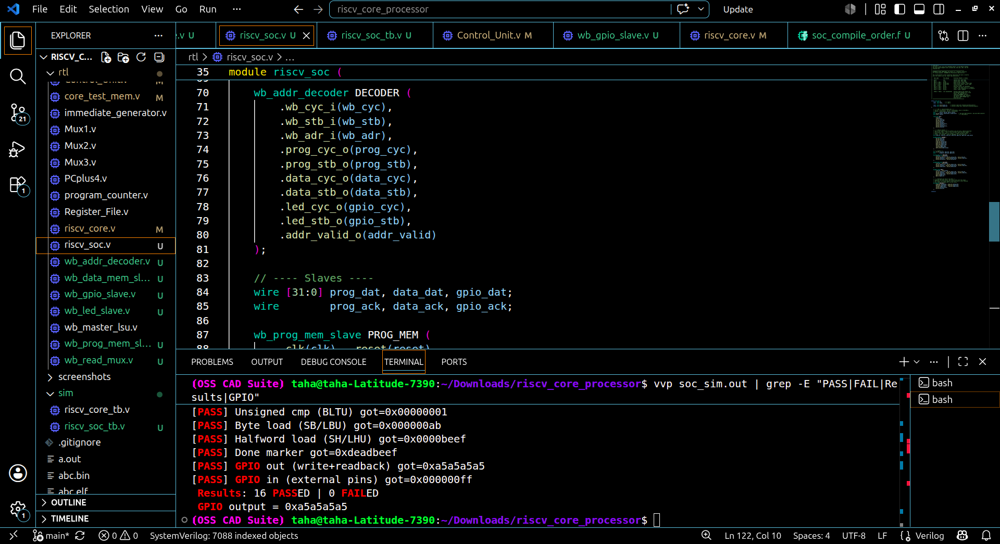
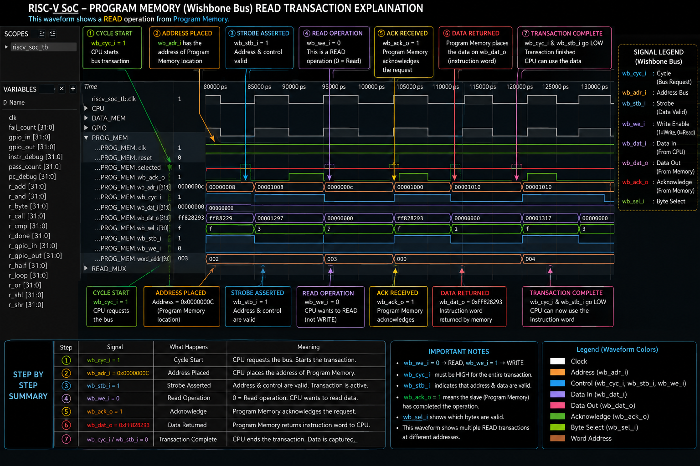
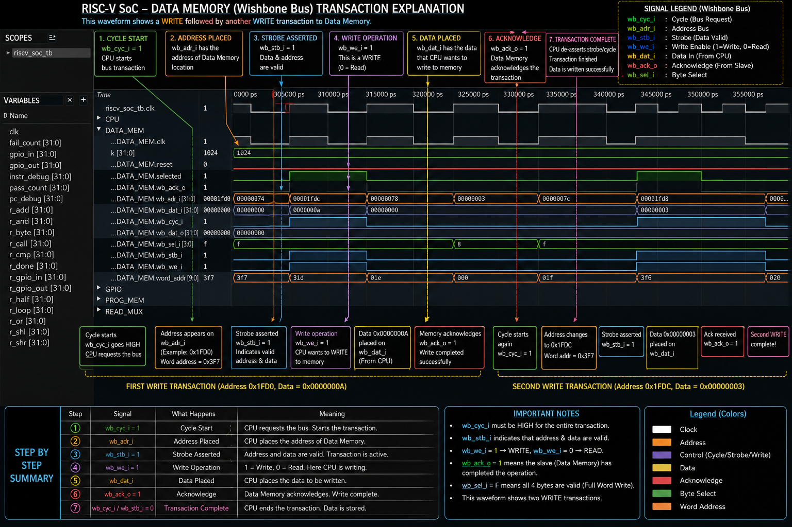
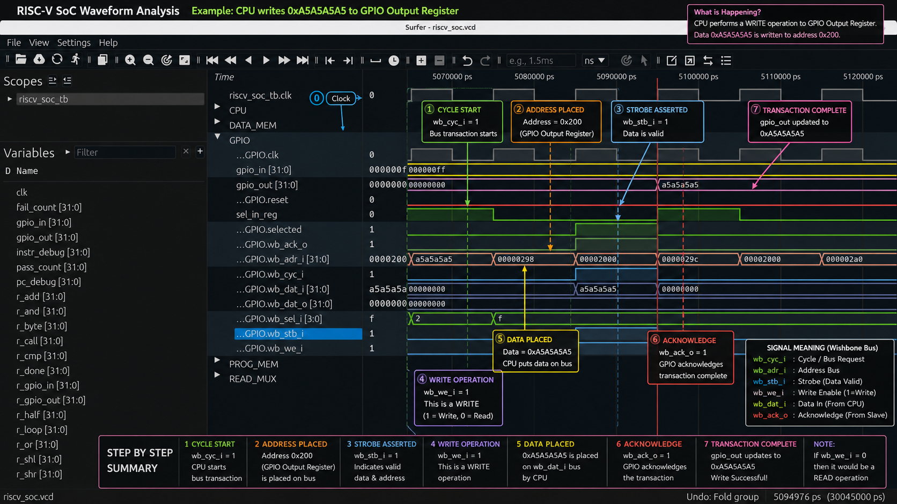

# Single-Cycle RISC-V (RV32I) System-on-Chip

A single-cycle RISC-V processor (RV32I) built from scratch in Verilog, integrated into a full WISHBONE B3-compliant System-on-Chip — designed, verified in simulation, made GCC-compatible, and now wired up with a real address-decoded bus and memory-mapped peripherals.

---

## Overview

This project implements a RISC-V CPU core module by module (ALU, register file, control unit, immediate generator, load/store unit, etc.), verifies each instruction class in simulation, integrates a full GCC toolchain flow (linker script + startup code + hex conversion), and wires the CPU into a complete WISHBONE SoC with an address decoder and three memory-mapped peripherals: program memory, data memory, and GPIO.

## Features

- Single-cycle RV32I datapath with a 2-cycle FETCH/EXEC Wishbone bus-master FSM
- Full WISHBONE B3-compliant bus: `CYC`, `STB`, `WE`, `SEL`, `ADR`, `DAT`, `ACK` handshaking
- Address decoder routing a single shared bus across 3 memory-mapped slaves
- Bidirectional GPIO peripheral (separate output-drive and external-input registers)
- Byte / halfword / word memory access with correct sign/zero extension
- Full branch and jump support: `BEQ`, `BNE`, `BLT`, `BGE`, `BLTU`, `BGEU`, `JAL`, `JALR`
- GCC-compatible: runs bare-metal, freestanding C programs compiled with the standard RISC-V GCC toolchain
- Verified in simulation with Icarus Verilog, with waveform inspection via GTKWave / Surfer

## Architecture

| Module | Purpose |
|---|---|
| `Adder.v` | General-purpose adder |
| `PCplus4.v` | Computes PC + 4 |
| `program_counter.v` | Holds current instruction address |
| `Mux1.v` / `Mux2.v` / `Mux3.v` | Datapath source selection |
| `Control_Unit.v` | Instruction decode → control signals |
| `ALU_Control.v` | Determines ALU operation |
| `ALU_unit.v` | Arithmetic / logic operations |
| `immediate_generator.v` | Sign-extends immediates |
| `Register_File.v` | 32 general-purpose registers (x0–x31) |
| `riscv_core.v` | CPU core; 2-cycle FETCH/EXEC Wishbone bus master |
| `wb_master_lsu.v` | Load/Store unit over Wishbone |
| `wb_addr_decoder.v` | Decodes CPU address into per-slave CYC/STB selects |
| `wb_read_mux.v` | Combines slave DAT/ACK back to the CPU |
| `wb_prog_mem_slave.v` | Program memory slave (0x0000–0x0FFF) |
| `wb_data_mem_slave.v` | Data memory slave (0x1000–0x1FFF) |
| `wb_gpio_slave.v` | GPIO peripheral slave (0x2000–0x2FFF) |
| `riscv_soc.v` | Top-level SoC: wires CPU, decoder, slaves, and read mux together |
| `core_test_mem.v` | Combined test memory for standalone core-only simulation |

## Memory Map

| Region | Address | Access |
|---|---|---|
| Program memory | `0x0000` – `0x0FFF` | R/W |
| Data memory | `0x1000` – `0x1FFF` | R/W |
| GPIO output register | `0x2000` | R/W (drives external output pins) |
| GPIO input register | `0x2004` | Read-only (external input pins) |

## Getting Started

### Prerequisites
- [Icarus Verilog](http://iverilog.icarus.com/) (`iverilog`, `vvp`)
- [GTKWave](http://gtkwave.sourceforge.net/) or [Surfer](https://surfer-project.org/) for waveform viewing
- RISC-V GCC toolchain (`gcc-riscv64-unknown-elf`) for compiling C programs

### Run the full SoC simulation
```bash
iverilog -g2012 -o soc_sim.out -f soc_compile_order.f
vvp soc_sim.out
```

### View waveforms
```bash
gtkwave riscv_soc.vcd
# or
surfer riscv_soc.vcd
```

### Compile and run a C program
```bash
# 1. Compile
riscv64-unknown-elf-gcc -march=rv32i -mabi=ilp32 -nostdlib -nostartfiles -ffreestanding \
  -T linker.ld crt0.s test_full.c -o test_full.elf

# 2. Extract raw binary
riscv64-unknown-elf-objcopy -O binary test_full.elf test_full.bin

# 3. Convert to hex (one 32-bit word per line)
od -An -v -tx4 --endian=little test_full.bin | tr -s ' ' '\n' | sed '/^$/d' > test_full.hex
```
The resulting `test_full.hex` is loaded automatically by `wb_prog_mem_slave.v` via `$readmemh(...)`.

## Test Results

`test_full.c` exercises 16 categories of instructions and peripheral access in a single run, with every result stored at a fixed data-memory address for reliable verification:

| Test | Instruction / peripheral | Expected |
|---|---|---|
| Addition | ADD | 13 |
| Subtraction | SUB | 7 |
| Bitwise AND | AND | 2 |
| Bitwise OR | OR | 11 |
| Bitwise XOR | XOR | 9 |
| Left shift | SLL | 40 |
| Right shift | SRA/SRL | 5 |
| Comparisons / if-else | BEQ/BNE/BLT/BGE/SLT | 3 |
| For-loop | branch-back | 45 |
| Function call | JAL/JALR + stack | 13 |
| Unsigned comparison | BLTU/SLTU | 1 |
| Byte store/load | SB/LBU | 0xAB |
| Halfword store/load | SH/LHU | 0xBEEF |
| Done marker | LUI+SW | 0xDEADBEEF |
| GPIO output (write + read-back) | GPIO slave, 0x2000 | 0xA5A5A5A5 |
| GPIO input (external pins) | GPIO slave, 0x2004 | 0x000000FF |

**Result: 16 / 16 passed** ✅ — verified through the real address-decoded WISHBONE bus (not a simplified single-memory test setup).

## Screenshots

**GCC-compatible output (C program compiled and verified on the core)**


**All 16 tests passing**


**Program memory slave (instruction fetch over Wishbone)**


**Data memory slave (load/store results over Wishbone)**


**GPIO peripheral (output write + external input read)**


## Project Structure
```
.
├── rtl/                     # All Verilog modules
├── sim/                     # Testbenches (riscv_core_tb.v, riscv_soc_tb.v)
├── screenshots/             # Waveform/result screenshots for this README
├── core_compile_order.f     # File list for standalone core-only simulation
├── soc_compile_order.f      # File list for the full SoC simulation
├── linker.ld                # Linker script for GCC
├── crt0.s                   # Startup assembly code
├── test_full.c              # Comprehensive instruction + peripheral test
└── README.md
```

## Roadmap

- [x] Full WISHBONE SoC integration (address decoder + 3 memory-mapped slaves)
- [x] GPIO peripheral (bidirectional: output drive + external input read)
- [ ] UART peripheral
- [ ] FPGA bring-up (Colorlight i5)
- [ ] Additional C test programs (recursion, arrays, structs)


